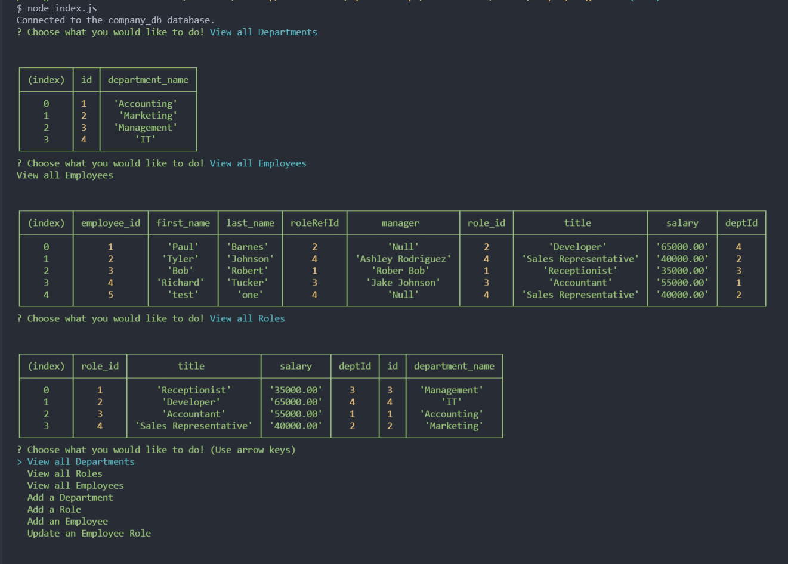
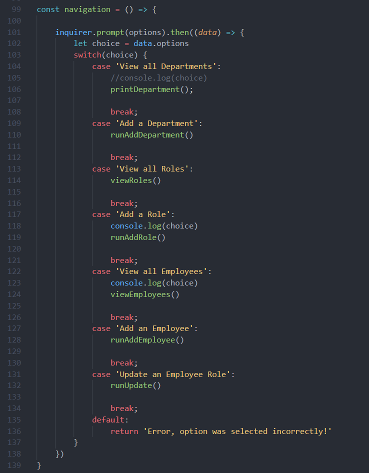
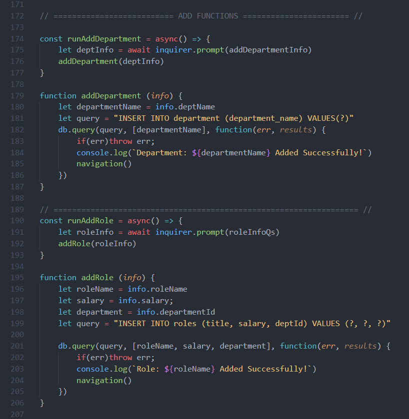

# Company-Organizer

## Introduction

This application is a backend company organizer, this application is able to organize and store your data for all your employee's, roles, and departments found within your company. This application runs with node.js and mySql for the database. Take a look at the install instructions to get started and head over to the feeback section to contact me.

Here is a walkthrough video showing off this applications functionality:

[Walkthrough Video](https://youtu.be/7LODeyATDeo)

## Description 

### Console
This application is executed through the console when running node index.js. It is built with establishing a connection through the mysql package to talk to the sql files found within the db folder. These packages work together in order to create the printout in the console you see below.

### Navigation
The navigation is all run through an inquirer.prompt with specified arrays that hold objects with question prompts, the selection by the user is then run through a switch case which decides what functions need to run and where to grab data. This switch case is printed below to give a snippet.

### Async Functions

All Functionality was written within the index.js file found at the root of the folder. It uses a combination of queries that work together with async function to display an order of print and working when running the application with node.

## Install 

To run this program you will need to clone down the repository. Once cloned open the files with your text editor of choice and open a terminal in this directory. run an Npm install on all the required packages listed below. Once installed the program should be able to run with an node index.js command within the terminal.

This application uses a combination of languages to implement. It uses: 

* Javascript
* HTML
* node.js
* express.js
* Inquirer
* Mysql2

[Mysql2](https://www.npmjs.com/package/mysql2)

[express](https://www.npmjs.com/package/express)

[Inquirer](https://www.npmjs.com/package/inquirer)

[Visual Studio Code](https://code.visualstudio.com/)

[GitHub Repository](https://github.com/PN-Barnes/PN-Barnes.github.io)

[Github](https://github.com/)

[git](https://git-scm.com/downloads)

# Feedback

If you would like to leave any feedback, reach out to me through any of the contact links listed within the page. My contact information will be listed under the "Contact" tab. 

[LinkedIn](https://www.linkedin.com/feed/)

[GitHub](https://github.com/PN-Barnes)